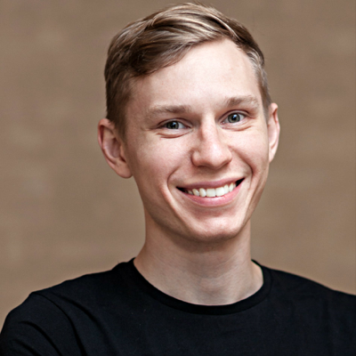

## *Andrey Salomatin*

  <h4 style="margin-top: 0">
    Tel: <a href="callto:+4915731580548">+49 1573 158 05 48</a>
  </h4>
  <h4 style="margin-top: 0">
    Website: <a href="https://flpvsk.com">flpvsk.com</a>
  </h4>
  <h4 style="margin-top: 0">
    Email: <a href="mailto:hello@flpvsk.com?subject=CV">hello@flpvsk.com</a>
  </h4>

#### Education

**2004 - 2010** 
Moscow Technical University of Communications and
Informatics 
Engineering degree in "Radio Communications, Broadcasting & Television"

#### Work

*   **01.2018-now** 
    **Maker at [Polychops](https://polychops.com)
    (Software for musicians, startup)**

    A personal project with a goal to help live musicians practice more
    and get more out of their practice.

    I'm doing product research, design and development, as well as
    managing contractors that work on marketing and sound design.

    Polychops launched in September 2018.

*   **10.2016-12.2017** 
    **Product Manager at [Productive
    Mobile](https://productivemobile.com), now
    [Matterway](https://matterway.io) (B2B SaaS startup)**

    As a Product Manager I was making sure we're building the right thing.

    I took over Product after being a senior engineer for two years. At
    that time we have started doing pilots with customers, our platform
    was covering about 30% of use cases and we have just undergone a major
    change in organization's structure. After one year in product, here is
    what we've achieved:

    * 30% of DAX companies are paid customers or piloting with Productive
      Mobile;

    * Platform coverage went from approximately 30% of use cases to 90%;

    * Time to deliver 80% of the use cases we support brought down from
      several weeks to several days or even hours;

    * Changes to the platform we've made now allow building *any mobile
      application* fast, extending beyond mobilization;

    * Collaboratively we've set up the goal of the company and metrics
      to measure our success as an organization as well as measure each
      department separately. It's hard to quantify these things, but I
      believe it allowed us to focus and improved communication between
      departments;

    * Together with engineering we've brought down uncertainty in lead
      times. Before it could take anything from a day to a month to
      finish a feature. With the changes tickets got to production
      within 8 days from the time engineer takes the ticket.

*   **09.2014-10.2016** 
    **Full-stack Javascript Developer at [Productive
    Mobile](https://productivemobile.com)**

    * In a small team we've built the product from the ground up;

    * As a senior member of the team, I helped set up processes and make
      technical decisions. As a result, we have received the highest
      rating during a tech due diligence from an independent contractor;

    * Among other things I was responsible for hiring and onboarding
      people to the engineering team. We were able to hire brilliant
      developers and QA engineers that formed the core of the team.

*   **2011-2014** 
    **Tech consultant / full-stack developer in various startups**

    During that time I was working in a number of companies that don't
    exist anymore. We've built products in online advertising, education
    and high-frequency trading. It was great fun.

    I'd be happy to provide details upon request.

<!--
*   **02.2014 - 04.2014**

    Python trainer at [SkillTrek](http://skilltrek.ru/) (developer
    trainings)

    As a freelancer, I've created and taught an "Introduction to Python"
    course for QA engineers.

*   **04.2013 - 09.2013**

    Full Stack Programmer at [Mindojo](http://mindojo.com) (online
    education)

    Mindojo is a smart educational platform. It allows building adaptive
    online courses, that improve from student to student. I was
    responsible for building [MVP](http://mindojo.com) and implementing
    features for [The Economist GMAT Tutor](https://gmat.economist.com/).

*   **12.2012 - 04.2013**

    Full Stack Programmer at [CPANET.WORK](http://www.cpanetwork.ru/)
    (affiliate marketing network)

    Designed and developed:

    - *Billing* app &mdash; Invoice/Transaction management;
    - *Advertiser's Cabinet* &mdash; campaign management and statistics;
    - *Affiliate's Cabinet* &mdash; advertising platform management and
      statistics.

    Everything was built using node.js with express, angular.js, mongodb.
    This allowed to validate/prototype/build new features very fast. It
    took 2-6 weeks to implement, test and release basic functionality for
    each application.

*   **07.2012 - 12.2012**

    Backend Programmer at [Heymoose](http://heymoose.com) (affiliate
    marketing network)

    -   Developed backend for affiliate marketing network;
    -   As a team, we've invented and developed integration scheme for
        e-commerce companies. It automated the most time-consuming parts of
        business. That saved days of work every month for us and our
        partners.

*   **08.2011 - 04.2012**

    Full Stack Programmer at *Algo inc.* (trading software)

    -   Took part in the development of *Trade Monitor*, FIX protocol data
        analysis tool. **Java** and **CoffeeScript**. Was able to design
        and implement a simple DSL for querying analyzed data;
    -   Support of *X41* project - highly
        distributed stocks trading platform, written in **Java**.
-->

*   **02.2010 - 07.2011** 
    **Team Lead, Internet Banking services at Probusinessbank**

    - I've started working on the Internet Banking system alone when the
      person responsible for it got promoted. Over two years we have
      gathered a strong team of five talented people across two offices in
      different cities. I was responsible for managing the work of the
      team;

    - Together we have designed and implemented a new version of the
      system with features like online payments, card and account
      management, internal messaging system and many others;

    - The services infrastructure that we've built in the process became a
      basis for many other internal and customer-facing applications,
      including our Android and iOS apps.

#### Side projects

* I [blog](https://medium.com/@flpvsk) and give talks on the topics of
  Software Development, System Thinking and Management;

* I make <a href="https://codepodcast.com/about">Code Podcast</a>. It's
  like Planet Money, but for developers;

* I was one of the organizers and helped grow
  <a href="www.moscowjs.ru">MoscowJS</a> to become the largest offline
  frontend community in Russia;

* Together with friends we made an international developer conference
  <a href="http://frontend-union-conf.github.io/func2016/">Frontend Union</a>;

* I was one of the original hosts of
  <a href="https://radiojs.ru">RadioJS</a>.
  The second most popular tech podcast in Russian iTunes in 2016.

